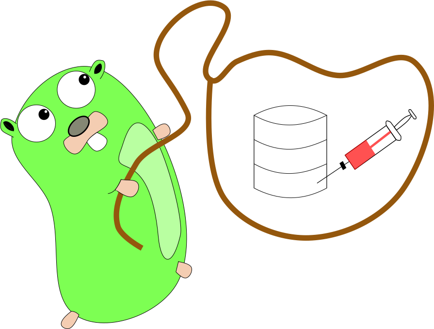

# Gotcha - **Go T**aint **Ch**eck **A**nalysis


[0 ]


Some theoretical background about this repository is available in our paper:
[Information Flow Analysis for Go](http://link.springer.com/chapter/10.1007/978-3-319-47166-2_30).
For more information about the project, also check the Acknowledgments.

## Requirements and Installation of gotcha on your local machine

0. [Installation of Go](https://golang.org/doc/install)
1. Go version below 1.8
   - Ensure that you have set the `$GOPATH`
   - Set the `$GOPATH` e.g. with `export GOPATH=$HOME/go` on a unix machine 
1. `go get github.com/akwick/gotcha`

Another variant is to install gotcha in a docker image. 
This can be done in a similar way: start a golang container and within this container execute the go get command (step 2). 


## Build the analysis

0. cd $GOPATH/src/github.com/akwick/gotcha
1. go build

## Run the analysis

0. ./analysis -path="path to go-files as relative part from $GOPATH/src" -src="path to source code file which should analyzed" -ssf="path to the sources and sinks file"
`./analysis -src="tests/exampleCode/hello.go"`
1. The -src flag is mandatory, the path, ssf, allpkgs, pkgs and ptrflag are optional.
2. The default parameter are:
  - path = github.com/akwick/gotcha
    - It is important to change the path if you are not running our examples.   
  - ssf = ./sourcesAndSinks.txt
    - Adopt this parameter if you want to use your own souces and sinks file
  - allpkgs = false
    - Analyse all packages 
  - pkgs = ""  
    - Only analyse the defined packages
  - ptr = true  
    - Analyse the program with the additional pointer analysis
3. `./analysis -h` prints a short help for the flags.  


# Test Results

We have several tests which ensure some functionality of our analysis.
The results are available via [Jenkins](https://envisage.ifi.uio.no:8080/jenkins/view/Vs-dev/job/GoRETech/)
Are more detailed descriptions about running tests on your machine are in the file [*tests.md*](https://github.com/akwick/gotcha/blob/master/tests.md)

# Debug the program

The repository has a small shell script which can build a debug file.
A reference for the commands is in the [repository of godebug](https://github.com/mailgun/godebug).

```
$ ./debug.sh
$ ./analysis.debug -src="fileyouwanttodebug"
```

# Acknowledgments

This analysis is part of my master thesis.
I want to thank all the people who were involved in this process: Eric Bodden, Michael Eichberg, Ka I Pun, Martin Steffen and Volker Stolz.

The work was partially supported by the Norwegian-German bilateral PPP project
GoRETech (GoRuntime Enforcement Techniques), the EU COST Action IC1402
“ARVI—Runtime Verification Beyond Monitoring” and the EU project FP7-610582
Envisage: Engineering Virtualized Services.

Last but not least I want to thank [women who Go Berlin](https://www.meetup.com/de-DE/Women-Who-Go-Berlin/) for giving me the chance to visit the dotgo 2016. Thanks Vanesa for this great day full of awesome talks.

[0 ] This image is created by Anna-Katharina Wickert under [Creative Commons 3.0 license](https://creativecommons.org/licenses/by/3.0/) based on Renee French under Creative Commons 3.0 Attributions. 
